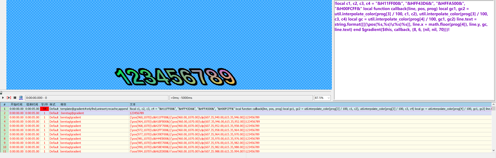

# 入门

### Aegisub 自动载入脚本

#### 安装版
将lua文件放到 `C:\Program Files\Aegisub\automation\autoload` 中

如果 Aegisub 安装在非默认位置，则同便携版

#### 便携版
将lua文件放到 `.\automation\autoload` 中

### 使用

先写一个简单的案例：

1. 将一行字幕注释掉，然后在特效(Effect)栏写上 `template@1#`，文本(Text)栏写上 `{tag1}{tag2}`
2. 再新建一行字幕，在特效(Effect)栏写上 `beretag@1#`，文本(Text)栏写上 `{tag1}12345`
3. 执行脚本


4. 执行后，第二行被注释掉了，新出现了第三行，且第三行的 `tag1` 被替换成了 `tag2`  
    这就是 `Tag Replace` 最底层的功能——替换标签

5. 执行脚本的清理功能，字幕还原成了原本的样子。  
    这就是 `Tag Replace` 的核心思想——随时重载+完全可逆。


# 模式

我们将特效栏为 `template` 开头的行简称为 `模板行` 或 `temp行`；`beretag` 开头的行简称为 `替换行` 或 `bere行`

通过入门案例的演示，大家应该能发现示例中的共同点——`@1`。这是 `Tag Replace` 语法的一部分，`@` 后可以跟随 类（class）名，当temp行与bere行的类名存在交集的时候，该temp行就会在该bere行上执行。  
例如入门案例中的 `{tag1}{tag2}`，就是将bere行中标签中（`{}`括起来的部分）的 `tag1` 替换为 `tag2`。

当 `template#` 时，为 code 行，仅用于执行代码。

temp行的 `#` 后跟的是模式名。

### 模式名

* #### <空>  
  默认模式

* #### pre  
  仅 code 行可使用的模式，这个模式的行将在所有行之前执行，且在 仅执行所选行 时同样强制执行

* #### onlyfind  
  不执行替换

* #### cuttag  
  将每次替换后的内容添加到新行，以被替换的{}位置作为切割点

* #### strictstyle  
  严格匹配样式名(`Style`)，仅对同样式名的行执行替换

* #### strictactor  
  严格匹配说话人(`Name`)，仅对同说话人的行执行替换

* #### strictclass  
  严格匹配class，必须所有class一致才会执行

* #### findtext  
  将匹配整行文本，而不是仅匹配标签

* #### append  
  新的行将被append到所有字幕行的末尾，而不是bere行的后面

* #### keyframe  
  将先执行关键帧替换，对应的关键帧文本为 `$keytext`，蒙版为 `$keyclip`。  
  对应的标准分别是 `Adobe After Effects 6.0 Keyframe Data` 和 `shake_shape_data 4.0`。  
  可通过 $forcefps 修改帧率，否则根据输入的追踪数据里的帧率计算时轴。
  ```lua
  Comment: 0,0:13:26.48,0:13:29.48,screen,屏幕字,0,0,0,template#,!$keytext=[[这里填入关键帧文本]]!
  Comment: 0,0:13:26.48,0:13:29.48,screen,屏幕字,0,0,0,template@key#keyframe;append,{这里可以替换掉一些没用的标签，例如\fscx.*\fscy.*\frz.*\org[^%)]*%)}{}
  Comment: 0,0:13:26.48,0:13:29.48,screen,屏幕字,0,0,0,:beretag@key,{一些标签}追踪文本
  ```

* #### recache  
  将缓存行(`$subcache`)插入到字幕

* #### uninsert  
  将不会插入新的bere行，与 `onlyfind` 模式同时存在时，将注释原bere行。

* #### cuttime  
  `{<start_tag>}{<end_tag>}`  
  bere行在时域上从 start_tag 渐变到 end_tag  
  修改 $cuttime 中的成员，可切换帧模式、修改加速度、自定义处理函数

* #### classmix  
  `{<class>[;<class>...]}{<class>[;<class>...]}[{<class>[;<class>...]}]`  
  合并两种类的行，第三个{}中是新的class


### 示例

#### 例1

可以通过 `findtext` 模式和正则表达式，把 `中文\N英文` 的行分割成双语字幕，并附带漏译检测

```lua
[Script Info]
ScriptType: v4.00+
WrapStyle: 0
ScaledBorderAndShadow: yes
YCbCr Matrix: TV.709
PlayResX: 1920
PlayResY: 1080
LayoutResX: 1920
LayoutResY: 1080

[Aegisub Project Garbage]
Video File: ?dummy:23.976:268000:1920:1080:47:163:254:c

[V4+ Styles]
Format: Name, Fontname, Fontsize, PrimaryColour, SecondaryColour, OutlineColour, BackColour, Bold, Italic, Underline, StrikeOut, ScaleX, ScaleY, Spacing, Angle, BorderStyle, Outline, Shadow, Alignment, MarginL, MarginR, MarginV, Encoding
Style: zh,黑体,120,&H00FFFFFF,&H000000FF,&H00000000,&H00000000,0,0,0,0,100,100,3,0,1,10,0,2,0,0,100,1
Style: en,宋体,80,&H00FFFFFF,&H000000FF,&H00000000,&H00000000,0,0,0,0,100,100,3,0,1,10,0,2,0,0,5,1
Style: zh-top,黑体,120,&H00FFFFFF,&H000000FF,&H00000000,&H00000000,0,0,0,0,100,100,3,0,1,10,0,8,0,0,100,1
Style: en-top,宋体,80,&H00FFFFFF,&H000000FF,&H00000000,&H00000000,0,0,0,0,100,100,3,0,1,10,0,8,0,0,14,1

[Events]
Format: Layer, Start, End, Style, Name, MarginL, MarginR, MarginV, Effect, Text
Comment: 0,0:00:00.00,0:00:00.00,zh,,0,0,0,template@dialog#onlyfind;uninsert;recache;append,!if not $text:find[[\N]] then $debug("对话行存在缺损: "..$num) end $addLine($this) if $style=="zh" then $this.style="en" elseif $style=="zh-top" then $this.style="en-top" else $debug("dialog error: "..$num) end $this.layer=1 $addLine($this)!
Comment: 0,0:00:00.00,0:00:00.00,zh,,0,0,0,template@dialog#findtext;strictstyle,{%\N.*}
Comment: 0,0:00:00.00,0:00:00.00,en,,0,0,0,template@dialog#findtext;strictstyle,{.*%\N}
Comment: 0,0:00:00.00,0:00:00.00,zh-top,,0,0,0,template@dialog#findtext;strictstyle,{%\N.*}
Comment: 0,0:00:00.00,0:00:00.00,en-top,,0,0,0,template@dialog#findtext;strictstyle,{.*%\N}
Dialogue: 0,0:00:00.00,0:00:05.00,zh,,0,0,0,beretag@dialog,一二三\None two three
Dialogue: 0,0:00:00.00,0:00:05.00,zh-top,,0,0,0,beretag@dialog,编辑字幕\NEdit ASS
```


#### 例2

演示使用 `keyframe` 模式制作追踪字幕

[字幕文件](ass/001.ass)


#### 例3

演示使用 `$gradient` 制作完全自定义的渐变效果
```lua
Comment: 0,0:00:00.00,0:00:05.00,Default,,0,0,0,template@gradient#onlyfind;uninsert;recache;append,!local function callback(line, pos, prog) local c1, c2, c3, c4 = "&H11FF00&", "&HFF43D6&", "&HFFA500&", "&H00FCFF&" local gc1, gc2 = util.interpolate_color(prog[3] / 100, c1, c2), util.interpolate_color(prog[3] / 100, c3, c4) line.text = [[{\c]] .. util.interpolate_color(prog[4] / 100, gc1, gc2) .. "}" .. line.text end $gradient($this, callback, {6, 6})!
Dialogue: 0,0:00:00.00,0:00:05.00,Default,,0,0,0,beretag@gradient,123456789
```



# 表达式与变量扩展

通过“扩展”语法，可以将自定义的计算后的值插入文本。

可以直接使用 $ 扩展变量 `{\k%d*}{\kf$kdur}`。

可以使用 `!...!` 扩展整个 Lua 语句，例如 `{\blur0}{\blur!local r=math.random(5) if r==3 then r=666 end return r!}`。


# 内置变量与关键字

Tag Replace 存在一些内置变量，用于方便用户操作。

Tag Replace 的操作规范中，局部变量同 lua 语法，全局变量使用 `$` 或 `user_var.` 作为开头，例如 `$number1`，本质上是 `$` 会被自动替换为 `user_var`。

关键字是会被直接替换的，它长得和全局变量一样，但不能真正调用到对应的变量，因为它会最优先被替换为对应值。

### 类型标注
* line 指的是 Aegisub API 字幕行对象
* list 指的是没有非 int key 的 table，只需用 list\[num\] 访问即可
* dict 指的是纯字典的 table
* int 指的是只有整数的 number


### 内置变量与关键字

* #### sub / \$sub
  `sub` 是使用规范中唯一允许用户调用的真正的全局变量，其与 `$sub` 一样，都是 Aegisub API 的 subtitle 对象

* #### \$this
  当前 bere 行的 karaskel 处理后的只读副本，用于方便访问bere行的属性  
  同时允许 `$` 直接访问 `$this` 的属性，例如 `$start_time` `$top`  
  额外给 `$this` 增加了一个整数成员属性 `$this.num`，是其 Aegisub 中用户看到的行号


* #### \$progress={0,0}
  当前进度的分子分母


* #### \$subcache
  待插入的字幕行列表。  
  可使用 `table.insert($subcache, line)` 手动插入行，或 `addLine(line)` 自动插入深拷贝


* #### \$kdur / user_var.kdur={0,0}
  这是 `\k` 标签后跟的值，可以在替换 karaok 标签时使用。  
  注意这是个关键字，如果需要调用其对应的变量，不能使用 `$`

* #### \$start $mid $end  
  这几个同样是关键字，但它们与 $kdur 不同的是，它们没有对应的变量，它们是实时计算出来的。  
  可配合 `\t` 使用以实现简单的 karaok 效果


* #### \$begin = find_event(sub)
  [Events]类型行的第一行，也是 Aegisub 字幕行的第一行对应的 index 号

* #### \$temp_line: int
  当前所读取的template行的键  
  调用对应行可以用 `sub[$temp_line]`

* #### \$bere_line: int
  当前所读取的beretag行的键  
  调用对应行可以用 `sub[$bere_line]`


* #### \$bere_text: str
  当前被替换的文本

* #### \$bere_match: list\[str\]
  匹配的文本的表
  e.g. `{\pos%((.-),(.-)%)}{\pos($bere_match[1],$bere_match[2])}`

* #### \$bere_num: int
  单temp行匹配的对应bere行的序号，从 1 开始

* #### \$exp_num: int
  单bere行执行的表达式扩展的序号，从 1 开始


* #### \$forcefps: false | number = false
  有值时，部分模式或函数按此值计算时轴

* #### \$keytext $keyclip
  `keyframe` 模式相关

* #### \$cuttime = {frame_model: bool = true, accel: number = 1, interpolate: function}
  `cuttime` 模式相关


# 内置函数

Tag Replace 存在一些内置函数，用于调用特殊功能和更改模式处理。

Tag Replace 的操作规范中，内置函数同样存储在 `user_var` 中，所以使用 `$` 或 `user_var.` 作为开头，例如 `$deepCopy`，本质上是`user_var.deepCopy`。


### 类型标注
* line 指的是 Aegisub API 字幕行对象
* list 指的是没有非 int key 的 table，只需用 list\[num\] 访问即可
* dict 指的是纯字典的 table
* int 指的是只有整数的 number
* ... 指的是 Lua 的解包列表，例如 `$addLine(line1, line2, lin3)` 可以一次性添加三个对象


### 功能性

* #### \$deepCopy(add: table) -> table  
  深复制 table 类型的变量

* #### \$checkVer(ver: str, is_must_equal: bool) -> nil  
  检查当前脚本版本是否≥指定版本，`is_must_equal` 可以强制等于

* #### \$debug(text, to_exit: bool)  
  弹窗输入的文本，按`确定`继续，按`取消`退出执行  
  `to_exit` 为 `true` 则在执行完函数后强制退出执行

* #### \$addClass(line, ...: str) -> nil  
  向字幕行对象添加任意个 class

* #### \$delClass(line, ...: str) -> nil  
  删除字幕行对象中任意个 class

* #### \$newClass(line, ...: str) -> nil  
  将字幕行对象中 class 全部替换为指定 class

* #### \$addLine(...: line) -> nil
  向 `$subcache` 中插入 `$deepCopy(line)`

* #### \$ms2f(ms: number) -> int
  根据载入的视频，将毫秒数转为帧数

* #### \$f2ms(f: int) -> number
  根据载入的视频，将帧数转为毫秒数

* #### \$enbase64(str) -> str
  将字符串编码为 base64 字符串

* #### \$debase64(str) -> str
  将 base64 字符串解码为原字符串


### 后处理

* #### \$cuttime.interpolate(current_time, total_time, start_value, end_value, tag) -> number  
  cuttime 模式的后处理函数，用于自定义插值算法，默认根据 `$cuttime.accel` 计算插值

* #### \$postProc(line)  
  一般模式的后处理函数，在执行每一行后对这行执行这个函数，默认为空函数

* #### \$keyProc(line, progress)  
  keyframe 模式的后处理函数，默认为空函数

* #### \$classmixProc(first: line, second: line, new_class: str) 
  classmix 模式的后处理函数，默认为 class 合并算法。  
  前两项形参分别是匹配第一个和第二个 `{}` 的行，第三个形参是第三个 `{}` 中的值。


### 行处理

* #### \$rePreLine(line, tags: str | nil) -> nil
  根据头部的 ASS 样式标签重新执行 karaskel 预处理

* #### \$gradient(line, callback, step, pos) -> nil
  ```lua
  @param line  
	@param callback: function(line, position: dict, progress: list) -> nil  
	　@position: {x, y, l, r, t, b, w, h, x_r = x - l, y_r = y - t}  
	　@progress: {x_fraction: list, y_fraction: list, x_percent: number, y_percent: number}  
	@param step: list | nil  
	　{x_step: number | nil, y_step: number | nil, expand: list | nil}  
	　　expand: list{number | nil} = {left, top, right, bottom}  
	@param pos: list | nil  
	　{x: number | nil, y: number | nil}
  ```
  `x_percent` 和 `y_percent` 取值范围是 `[0, 100]`。  
  生成的新行直接插入到 `$subcache`。

* #### \$colorGradient(line_info, rgba, step_set, tags, control_points, pos) -> nil
  见旧版文档

* #### \$getTagCut(text: str) -> list[list[str, bool, int]]
  输入一个字符串，返回按 tag 出现顺序切割的 table `{{text: str, is_tag: bool, num: int}, ...}`
  ```lua
  $getTagCut("1{22}333{}{}") ->
  {
    {"1"   , false, 1},
    {"{22}", true , 1},
    {"333" , false, 2},
    {"{}"  , true , 2},
    {"{}"  , true , 3}
  }
  ```

* #### \$posLine(line, width: number | nil) -> nil  
  生成定位线，生成新定位线行直接插入到 `$subcache`


### 调用外部

* #### \$cmdCode(cmd: str, popen: bool) -> string | bool
  调用命令行，使用 popen 时返回输出结果，否则返回是否成功的 bool 值

* #### \$psCode(cmd: str, popen: bool) -> string | bool
  调用 PowerShell，会自动预处理字符串

* #### \$pyCode(cmd: str, popen: bool) -> string | bool
  调用 Python，会自动预处理字符串

* #### \$getGlyph(char, line) -> str
  传入字符和对应样式的行对象，输出字符对应的 ASS 绘图代码  
  （目前处于实验性阶段，通过 powershell 调用 WPF API，效率很低）
